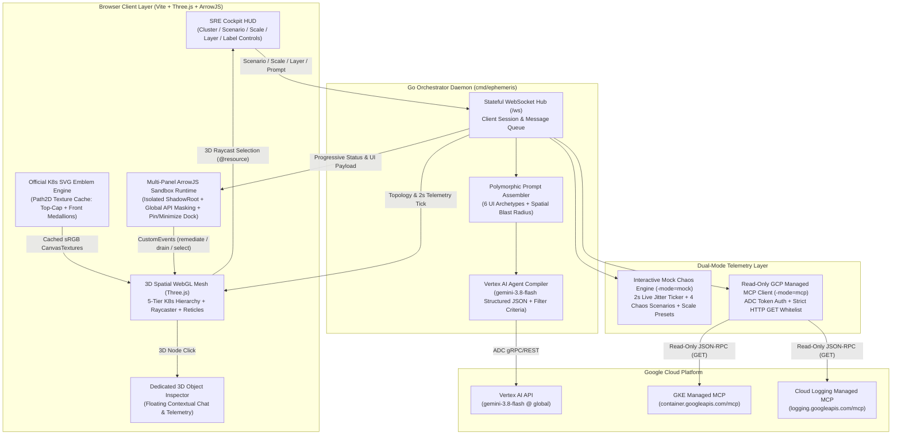
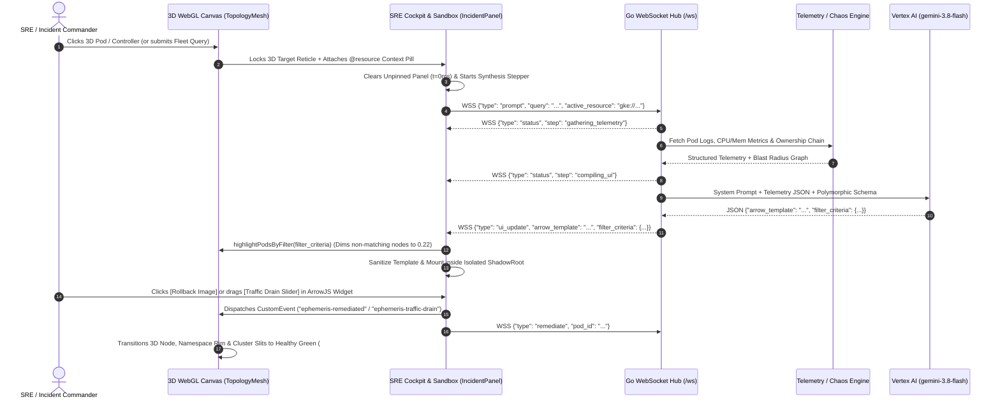
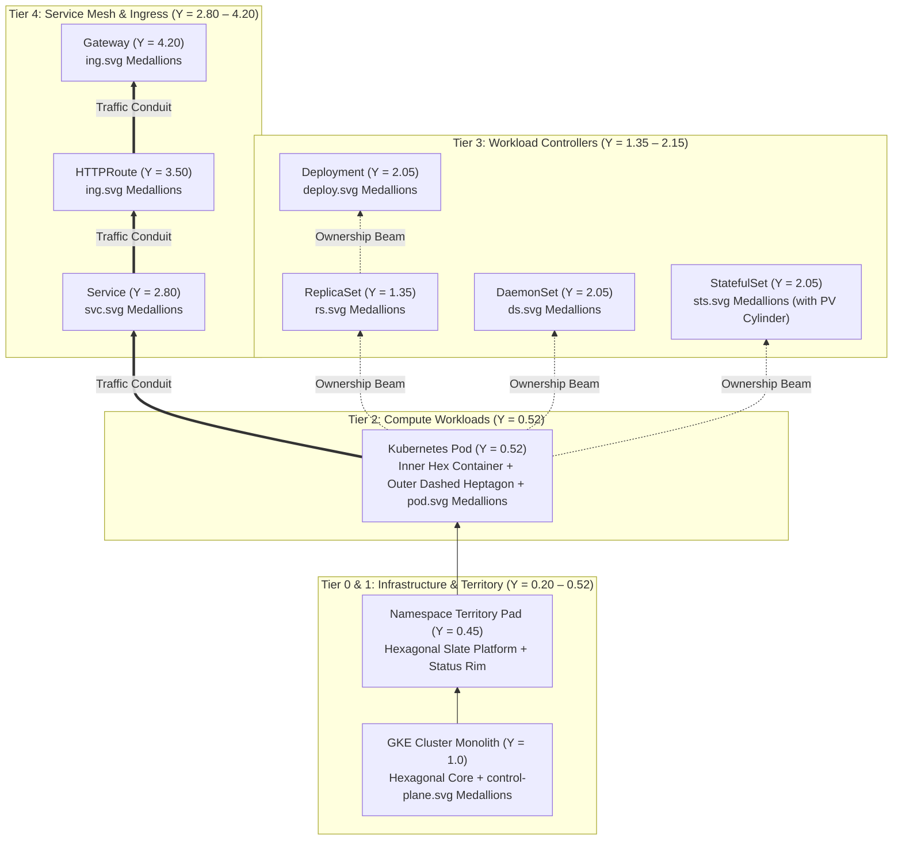
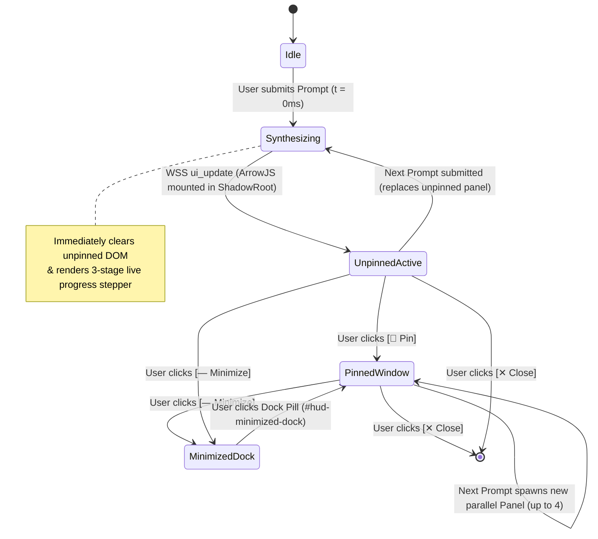

# Ephemeris System Architecture & Technical Stack

> **Canonical Architectural Specification (`v1.0`)**
> `ephemeris` is a generative spatial observability platform for Google Kubernetes Engine (GKE). It replaces static 2D dashboards with an interactive 3D WebGL topological mesh paired with an isolated `@arrow-js/core` reactive UI runtime powered by Vertex AI (`gemini-3.8-flash`).

---

## 1. System Context & Component Architecture

`ephemeris` decouples telemetry ingestion from UI presentation. Instead of routing metrics and logs into rigid, pre-built dashboards, spatial context and live telemetry are streamed to a Go WebSocket orchestrator (`cmd/ephemeris`) which compiles task-specific, interactive ArrowJS UI widgets on the fly and mounts them inside an isolated browser `ShadowRoot`.

---

## 2. End-to-End Generative UI & Spatial Filtering Sequence

When an SRE clicks a 3D Kubernetes object or submits a natural-language triage prompt, `ephemeris` executes a synchronized spatial-and-generative pipeline:

---

## 3. Stratified 3D Spatial Topology & Official Kubernetes SVG Medallions

To eliminate visual flattening and label clutter across multi-cluster fleets, `TopologyMesh` ([`web/src/canvas/topology.js`](file:///usr/local/google/home/garisingh/projects/ephemeris/web/src/canvas/topology.js)) organizes Kubernetes resources into **5 stratified vertical elevation tiers** and stamps every 3D object with **Official Kubernetes Community SVG Medallions** ([`web/src/canvas/k8s-icons.js`](file:///usr/local/google/home/garisingh/projects/ephemeris/web/src/canvas/k8s-icons.js)).

### 3.1 Dual Surface-Mounted Medallions (`Top-Cap` + `Front-Face`)
Rather than floating billboard icons that clutter vertical sightlines, [`createK8sSurfaceMedallions`](file:///usr/local/google/home/garisingh/projects/ephemeris/web/src/canvas/k8s-icons.js#L334) renders official Kubernetes vector paths (`viewBox="0 0 18.035334 17.500378"`) via `Path2D` onto cached `sRGB` `THREE.CanvasTexture` instances and mounts two 7-sided medallions directly onto each 3D geometry:
- **Top-Cap Medallion (`rotation.x = -Math.PI / 2`):** Flush on the top surface (`+Y`) for immediate recognition during aerial/overview navigation.
- **Front-Face Medallion (`+Z` flat face):** Flush on the rotated front polygon face (`rotateY(Math.PI / radialSegments)`) with `polygonOffset` for close-up inspection.

### 3.2 Semantic Zoom Bands & Smart Label Modes
`TopologyMesh` continuously evaluates camera distance (`originDist`) across **4 Semantic Zoom Bands**, surfaced live in `#hud-perf-pill` (`60 FPS • 45 Obj • Zoom: Cluster`):

| Semantic Zoom Band | Camera Distance (`originDist`) | Visual Behavior in Default `Hover & Trouble` Label Mode |
| :--- | :---: | :--- |
| **`Macro`** | `> 75` world units | Shows Cluster & Namespace plaques + high-priority incident badges (`CrashLoopBackOff` / `Failed`). Hides healthy pod medallions and labels. |
| **`Cluster`** | `35 – 75` world units | Shows all Top-Cap & Front-Face K8s SVG medallions + incident labels. Healthy node labels reveal on pointer flyover hover (`setHoveredNode`). |
| **`Namespace`** | `18 – 35` world units | Shows full ownership & networking beams + flyover chain labels (`_computeChainIds`). |
| **`Micro`** | `<= 18` world units | Automatically reveals nearby healthy resource labels (`isZoomedInClose`) alongside front-facing K8s medallions. |

---

## 4. ArrowJS Sandbox Security & Multi-Panel Windowing Lifecycle

LLM-generated UI code is untrusted by default. [`ArrowSandboxRuntime`](file:///usr/local/google/home/garisingh/projects/ephemeris/web/src/sandbox/runtime.js) and [`IncidentPanel`](file:///usr/local/google/home/garisingh/projects/ephemeris/web/src/ui/incident-panel.js) enforce strict execution isolation and multi-window ergonomics:

### Key Sandbox Guardrails
1. **Shadow DOM Encapsulation:** Every floating panel creates an isolated `ShadowRoot` (`attachShadow({ mode: 'open' })`) with scoped dark-glass styles so generated CSS cannot leak into the Three.js canvas or HUD.
2. **Global API Masking:** Inside [`ArrowSandboxRuntime.mount`](file:///usr/local/google/home/garisingh/projects/ephemeris/web/src/sandbox/runtime.js), `new Function('html', 'reactive', 'telemetry', 'window', 'document', 'localStorage', 'sessionStorage', 'fetch', 'XMLHttpRequest', ...)` explicitly passes `undefined` for all browser network and storage globals.
3. **Template Attribute Auto-Repair:** [`_sanitizeTemplate`](file:///usr/local/google/home/garisingh/projects/ephemeris/web/src/sandbox/runtime.js) rewrites partial attribute interpolations (e.g. `style="width: ${() => val}%"`) into full attribute bindings (`style="${() => `width: ${val}%`}"`) required by `@arrow-js/core` before evaluation.
4. **Viewport Clamping:** [`_clampToViewport`](file:///usr/local/google/home/garisingh/projects/ephemeris/web/src/ui/incident-panel.js) prevents any floating window header from sliding underneath the top HUD navigation bar (`top >= 64px`).

---

## 5. Complete Technical Stack & Package Map

### 5.1 Technology Stack

| Layer | Technology | Version / Target | Purpose |
| :--- | :--- | :--- | :--- |
| **3D Rendering** | `three` (Three.js WebGL) | `^0.174.0` | Hierarchical 3D scene graph, OrbitControls, Raycaster, PBR materials, Bézier particle conduits |
| **Generative UI Runtime** | `@arrow-js/core` | `^1.0.0-alpha.10` | Zero-build-step reactive template literals (`html`, `reactive`) executing in `ShadowRoot` |
| **Frontend Bundler & Test** | `vite` + `vitest` + `jsdom` | Vite `^6.4.3` / Vitest `^3.0.7` | Sub-2s production bundling into `internal/webui/dist/` + 51 headless unit tests |
| **Backend Orchestrator** | Go (`golang.org/x/net/websocket`) | Go `1.24+` | High-concurrency `/ws` hub, single-binary `embed.FS` server, chaos ticker |
| **LLM Compiler** | Vertex AI (`google.golang.org/genai`) | `gemini-3.8-flash` (`global`) | Polymorphic ArrowJS template + `filter_criteria` JSON compilation via ADC |
| **Cloud Telemetry** | GCP Managed MCP (`pkg/mcp`) | JSON-RPC 2.0 over HTTPS | Read-only `GET`-whitelisted queries to `container.googleapis.com/mcp` & `logging.googleapis.com/mcp` |

### 5.2 Repository Package & Module Map

| Path | Responsibility |
| :--- | :--- |
| [`cmd/ephemeris/main.go`](file:///usr/local/google/home/garisingh/projects/ephemeris/cmd/ephemeris/main.go) | Main binary entrypoint (`-mode=mock\|mcp`, `-port=8080`, `-gcp-project`, `-location=global`). |
| [`cmd/verify/main.go`](file:///usr/local/google/home/garisingh/projects/ephemeris/cmd/verify/main.go) | Automated E2E post-deployment verification probe (`/healthz`, SPA bundle, and `/ws` handshake + ArrowJS compilation). |
| [`pkg/api/types.go`](file:///usr/local/google/home/garisingh/projects/ephemeris/pkg/api/types.go) | WebSocket protocol DTOs (`WSMessage`, `ClusterTopology`, `K8sResource`, `PodSummary`, `FilterCriteria`). |
| [`pkg/orchestrator/`](file:///usr/local/google/home/garisingh/projects/ephemeris/pkg/orchestrator/hub.go) | Stateful `/ws` hub (`hub.go`), polymorphic prompt assembler (`prompt.go`), and Vertex AI `gemini-3.8-flash` compiler (`compiler.go`). |
| [`pkg/gke/`](file:///usr/local/google/home/garisingh/projects/ephemeris/pkg/gke/mock.go) | Multi-cluster GKE topology engine (`mock.go`, `mcp.go`) with 4 live Chaos Scenarios and 3 Fleet Scale Presets (`standard`, `medium`, `large`). |
| [`pkg/telemetry/`](file:///usr/local/google/home/garisingh/projects/ephemeris/pkg/telemetry/mock.go) | Pod log tailing, CPU/memory time-series generator, and 2-second live metric jitter engine. |
| [`pkg/mcp/client.go`](file:///usr/local/google/home/garisingh/projects/ephemeris/pkg/mcp/client.go) | Read-only GCP Managed MCP client using Application Default Credentials (ADC). |
| [`web/src/canvas/topology.js`](file:///usr/local/google/home/garisingh/projects/ephemeris/web/src/canvas/topology.js) | 5-tier 3D WebGL scene builder, ownership & dependency beams, semantic zoom bands, and `Hover & Trouble` label engine. |
| [`web/src/canvas/k8s-icons.js`](file:///usr/local/google/home/garisingh/projects/ephemeris/web/src/canvas/k8s-icons.js) | Official Kubernetes SVG `Path2D` canvas texture registry and Top-Cap + Front-Face medallion factory. |
| [`web/src/sandbox/runtime.js`](file:///usr/local/google/home/garisingh/projects/ephemeris/web/src/sandbox/runtime.js) | Isolated `ShadowRoot` ArrowJS evaluator, browser global masker, and template sanitizer. |
| [`web/src/ui/incident-panel.js`](file:///usr/local/google/home/garisingh/projects/ephemeris/web/src/ui/incident-panel.js) | Multi-panel draggable window manager (`📌 Pin`, minimize dock, viewport boundary clamping, progressive synthesis stepper). |
| [`web/src/ui/object-chat.js`](file:///usr/local/google/home/garisingh/projects/ephemeris/web/src/ui/object-chat.js) | Dedicated 3D Object Inspector & contextual chat window triggered on 3D node click. |
| [`web/src/ui/hud.js`](file:///usr/local/google/home/garisingh/projects/ephemeris/web/src/ui/hud.js) | Top SRE status bar (Cluster, Chaos Scenario, Scale, 3D Layer, Labels, FPS/Zoom pill) and bottom prompt dock. |
