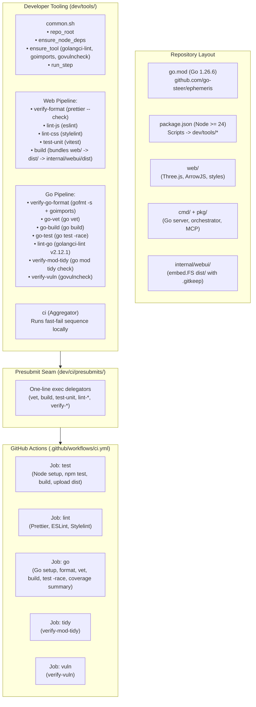

# Implementation Plan: Project Setup & CI Infrastructure

## 1. Executive Summary

This plan defines the foundational project setup, developer tooling, and CI pipeline for `ephemeris` (`github.com/go-steer/ephemeris`), synthesizing the proven architectures of both [`core-agent`](file:///usr/local/google/home/garisingh/projects/core-agent) (pure Go agent framework) and [`mast-web`](file:///usr/local/google/home/garisingh/projects/mast-web) (Go server + Web SPA).

`ephemeris` shares the exact hybrid profile of `mast-web`:
1. **Frontend:** WebGL 3D canvas (Three.js) and ArrowJS reactive runtime (`web/`).
2. **Backend:** Go orchestrator daemon serving WebSocket telemetry and Gemini prompts (`cmd/ephemeris`, `pkg/`).
3. **Distribution & Embedding:** Single binary via Go's `embed.FS` (`internal/webui/dist`), while supporting split deployment and instant local iteration via `--web-dir=<path>` or Vite HMR.
4. **Developer Tooling Principle:** "Keep the wiring boring — logic lives in `dev/tools/`, not in YAML." `dev/tools/` is the single source of truth for both local development and remote CI.



---

## 2. Key Architecture & Design Decisions

### 2.1 Zero-Dependency Fresh Clone Guarantee (`internal/webui/dist/.gitkeep`)
Following `mast-web`, we place a tracked `.gitkeep` inside `internal/webui/dist/`. This ensures that a developer on a fresh clone can run `go build ./...` or `go test ./...` immediately without being forced to run `npm install` and `npm run build` first. `dev/tools/build` will build the web assets into top-level `dist/` and mirror them into `internal/webui/dist/`.

### 2.2 Explicit Package Scoping for Go Commands
When Go and Node share a repository, running `go test ./...` or `go build ./...` can accidentally traverse into `node_modules` (which may contain stray `.go` files from npm packages). Therefore, all Go scripts explicitly target `./cmd/... ./pkg/... ./internal/...` rather than unconstrained `./...`.

### 2.3 Single-Source Tooling Suite (`dev/tools/`)
All developer tasks (`build`, `test`, `lint`, `format`, `ci`) are standalone bash scripts under `dev/tools/`.
- `dev/tools/common.sh`: provides `repo_root()`, `ensure_node_deps()` (auto-installs npm dependencies), `ensure_tool()` (auto-installs Go binaries into `$GOBIN`), and `run_step()`.
- `dev/tools/ci`: aggregator script running the fast-fail suite locally.
- `dev/ci/presubmits/*`: thin one-line scripts that `exec dev/tools/<name> "$@"`.

---

## 3. Directory Layout & File Structure

```
ephemeris/
├── package.json                    # Root package.json with scripts delegating to dev/tools/*
├── package-lock.json
├── eslint.config.js                # ESLint 9 flat config
├── .prettierrc.json                # Prettier configuration
├── .prettierignore
├── .stylelintrc.json               # Stylelint CSS rules
├── go.mod                          # Go module: github.com/go-steer/ephemeris
├── go.sum
├── Makefile                        # Convenience wrappers calling dev/tools/*
├── .gitignore
├── LICENSE
├── internal/
│   └── webui/
│       ├── webui.go                # embed.FS embedding dist/
│       └── dist/
│           └── .gitkeep            # Tracked placeholder for zero-dep fresh clone
├── dev/
│   ├── README.md
│   ├── tools/
│   │   ├── common.sh               # Shared helper functions (ensure_node_deps, ensure_tool)
│   │   ├── ci                      # Local fast-fail aggregator
│   │   ├── dev                     # Local dev runner (Go backend + Vite HMR)
│   │   ├── build                   # Webpack/Vite bundler -> dist/ & internal/webui/dist
│   │   ├── test-unit               # Vitest unit test runner
│   │   ├── lint-js                 # ESLint runner
│   │   ├── lint-css                # Stylelint runner
│   │   ├── verify-format           # Prettier check (read-only)
│   │   ├── fix-format              # Prettier auto-fixer
│   │   ├── go-vet                  # go vet ./cmd/... ./pkg/... ./internal/...
│   │   ├── go-build                # go build ./cmd/... ./pkg/... ./internal/...
│   │   ├── go-test                 # go test -race -cover ./cmd/... ./pkg/... ./internal/...
│   │   ├── verify-go-format        # gofmt -s + goimports check (read-only)
│   │   ├── fix-go-format           # gofmt -s -w + goimports -w auto-fixer
│   │   ├── lint-go                 # golangci-lint runner (pinned v2.12.1)
│   │   ├── .golangci.yml           # Conservative golangci-lint config from core-agent
│   │   ├── verify-mod-tidy         # go mod tidy clean check
│   │   └── verify-vuln             # govulncheck scanner
│   └── ci/
│       └── presubmits/             # One-line delegators for GitHub Actions
│           ├── build
│           ├── test-unit
│           ├── lint-js
│           ├── lint-css
│           ├── verify-format
│           ├── go-vet
│           ├── go-build
│           ├── go-test
│           ├── verify-go-format
│           ├── lint-go
│           ├── verify-mod-tidy
│           └── verify-vuln
└── .github/
    └── workflows/
        └── ci.yml                  # GitHub Actions workflow running presubmits
```

---

## 4. Verification & Quality Gates

### Local Verification
```bash
# Run all checks locally (identical to remote CI)
dev/tools/ci

# Run all checks even after failures to see everything at once
dev/tools/ci --keep-going

# Auto-fix formatting across Go and web assets
dev/tools/fix-format
dev/tools/fix-go-format
```

### GitHub Actions Pipeline (`.github/workflows/ci.yml`)
- `test`: Setup Node 24, run `test-unit`, run `build`, upload `dist/` artifact.
- `lint`: Setup Node 24, run `verify-format`, `lint-js`, `lint-css`.
- `go`: Setup Go 1.26, run `verify-go-format`, `go-vet`, `go-build`, `lint-go`, `go-test -race`, upload coverage profile and publish markdown step summary.
- `tidy`: Setup Go 1.26, verify `go mod tidy` is clean.
- `vuln`: Setup Go 1.26, run `govulncheck`.
