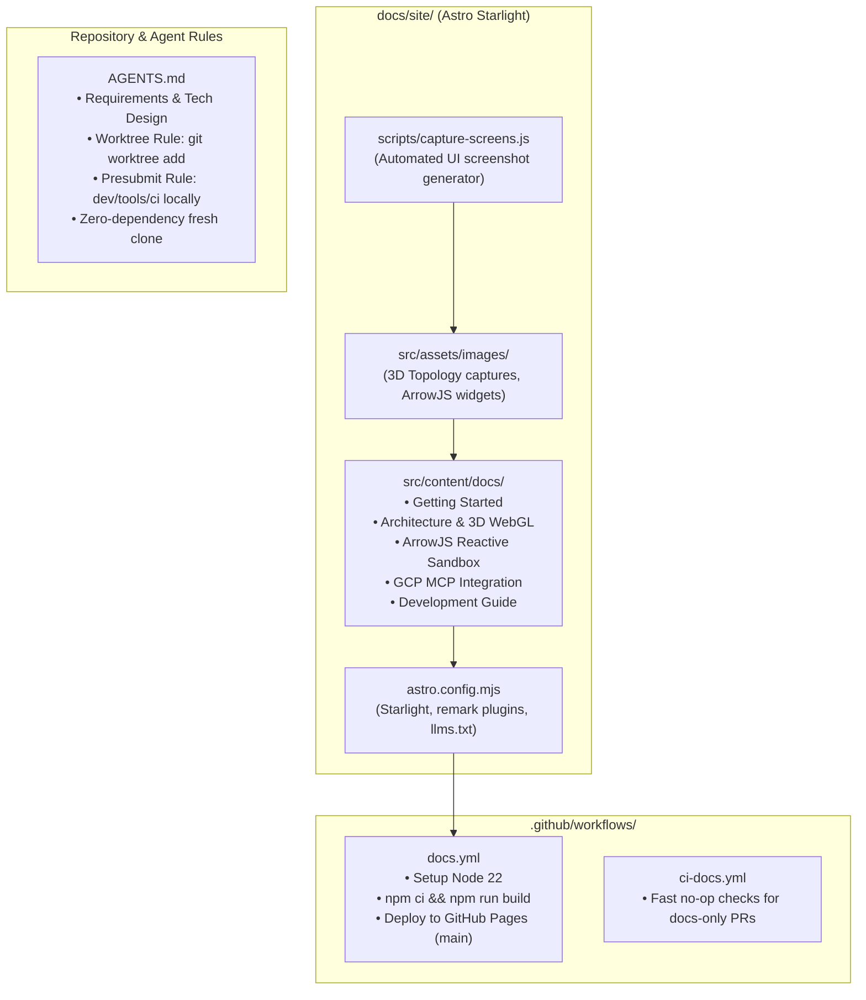

# Implementation Plan: AGENTS.md & Astro/Starlight Documentation Site

## 1. Overview

This plan establishes the project-level agent instructions ([`AGENTS.md`](file:///usr/local/google/home/garisingh/projects/ephemeris/AGENTS.md)) and the developer documentation site (`docs/site/`) for `ephemeris`.

1. **`AGENTS.md`**: Captures product vision, architecture, repo layout, build/test commands, and non-negotiable operational rules:
   - **Always use git worktrees for each feature branch** (isolated working directories rather than in-place branch switching).
   - **Always run presubmits locally when possible** (`dev/tools/ci`, `make ci`) before pushing.
   - **Code and commit conventions** (Conventional Commits, Google Apache 2.0 license headers, zero-dependency fresh clone, package scoping for Go).
2. **Documentation Site (`docs/site/`)**:
   - Adopts **Astro + Starlight** (`@astrojs/starlight`), the current standard in `go-steer` (as seen in [`k8s-lookout`](file:///usr/local/google/home/garisingh/projects/k8s-lookout)), completely replacing legacy Hugo.
   - Generates `llms.txt` automatically via `starlight-llms-txt`.
   - **Screen/UI Strategy**: Provides a structured asset pipeline for 3D WebGL canvas screenshots, ArrowJS widget captures, and responsive images, with an optional automated capture utility using Playwright.
   - **GitHub Actions Workflows**: `.github/workflows/docs.yml` (Astro build + GitHub Pages deploy) and `.github/workflows/ci-docs.yml` (companion no-op fast check for markdown-only changes).



---

## 2. Key Architecture & Operational Rules

### 2.1 Git Worktree Workflow Standard
In `AGENTS.md`, we codify the feature branch rule:
- Never switch branches in-place in the primary working tree for non-trivial feature work.
- Always spawn an isolated git worktree:
  ```bash
  git worktree add ../ephemeris-<feature-name> -b feat/<feature-name>
  ```
- When work is merged or abandoned:
  ```bash
  git worktree remove ../ephemeris-<feature-name>
  ```

### 2.2 Local Presubmits Before Every Push
In `AGENTS.md`, we establish the rule:
- Run `dev/tools/ci` locally before pushing or opening a PR.
- Fast-fail order ensures formatting, linting, unit tests, and security scans run in < 60s.

### 2.3 Astro + Starlight Stack
- Replaces Hugo entirely with standard Node/npm tooling.
- Full markdown/MDX support, Mermaid diagrams out of the box, automated `llms.txt` generation via `starlight-llms-txt`.
- Native image processing via Sharp.

---

## 3. Directory Layout & File Structure

```
ephemeris/
├── AGENTS.md                       # Project memory, rules, layout, and conventions
├── docs/
│   ├── design/                     # Architectural design documents
│   │   ├── requirements.md
│   │   ├── tech-design.md
│   │   ├── mvp-plan.md
│   │   ├── ci-plan.md
│   │   └── docs-and-agents-plan.md
│   └── site/                       # Astro Starlight documentation site
│       ├── package.json
│       ├── astro.config.mjs
│       ├── src/
│       │   ├── assets/
│       │   │   └── images/         # 3D topology captures & ArrowJS widget screenshots
│       │   └── content/
│       │       └── docs/
│       │           ├── index.mdx
│       │           ├── getting-started/
│       │           ├── architecture/
│       │           ├── spatial-canvas/
│       │           └── generative-ui/
└── .github/
    └── workflows/
        ├── docs.yml                # Astro build & GitHub Pages deploy
        └── ci-docs.yml             # Fast companion no-op for markdown-only changes
```
