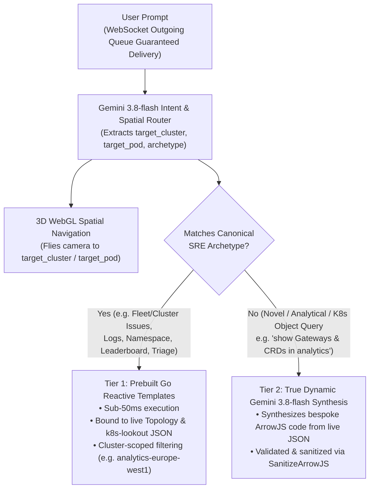

# Architectural Design: Two-Tier Hybrid Generative UI, Cluster-Scoped Queries, & Core K8s/CRD Resource Model

## 1. Overview & Motivation

As `ephemeris` scales from single-pod incident triage to multi-cluster fleet observability, two architectural requirements emerge:

1. **Two-Tier Hybrid Generative UI:**
   - **Tier 1: Prebuilt Reactive Go Templates (Data-Bound & Cluster-Scoped):** For high-frequency canonical SRE workflows (`issues_matrix`, `namespace_inventory`, `resource_leaderboard`, `logs_console`, `deep_triage`), prebuilt ArrowJS reactive templates bound to live backend JSON deliver sub-50ms Time-to-Interactive (TTI) and 100% deterministic controls (`🛠️ Fix Now`, `🎯 Focus 3D`, `📜 Logs`, `k8s-lookout` findings).
   - **Tier 2: True Dynamic Gemini 3.8-flash UI Synthesis (`ArchetypeDynamicCustom`):** When an engineer asks a novel, comparative, or resource-specific question (e.g. *"show me the Gateways, HTTPRoutes, and Deployments in production"*, *"what CRDs are running in analytics-europe-west1?"*, or *"compare restart counts and CPU between staging and production"*), `gemini-3.8-flash` inspects the live topology JSON and synthesizes a bespoke ArrowJS component on the fly.

2. **Core Kubernetes Objects & Dynamic CRD Resource Hierarchy:**
   - Real GKE clusters consist of a rich object graph beyond `Pods`: traffic enters via **`Gateway` / `HTTPRoute`** (`gateway.networking.k8s.io/v1`), routes through **`Service`** (`v1`), is managed by **`Deployment` / `StatefulSet`** controllers (`apps/v1`), and frequently includes **Custom Resource Definitions (CRDs)** such as `SparkApplication` (`sparkoperator.k8s.io/v1beta2`) or `RayCluster` (`ray.io/v1`).
   - Modeling `K8sResource` records in `TopologyData` enables both Tier 1 and Tier 2 UI synthesis to reason over the full Kubernetes control plane.

---

## 2. Two-Tier Hybrid Generative UI Pipeline



---

## 3. Core Kubernetes & CRD Schema (`pkg/api/types.go`)

Each `Namespace` in `TopologyData` includes `Resources []K8sResource` alongside `Pods []Pod`:

```go
type K8sResource struct {
    ID          string   `json:"id"`
    Kind        string   `json:"kind"`        // Gateway, HTTPRoute, Service, Deployment, StatefulSet, SparkApplication, RayCluster
    APIVersion  string   `json:"api_version"` // gateway.networking.k8s.io/v1, apps/v1, sparkoperator.k8s.io/v1beta2, ray.io/v1
    Name        string   `json:"name"`
    Namespace   string   `json:"namespace"`
    Cluster     string   `json:"cluster"`
    Status      string   `json:"status"`      // Healthy, Progressing, Degraded, CrashLoopBackOff
    Replicas    string   `json:"replicas,omitempty"`
    IsCRD       bool     `json:"is_crd,omitempty"`
    Summary     string   `json:"summary"`
    ConnectedTo []string `json:"connected_to,omitempty"`
}
```

### Dynamic CRD Discovery Roadmap (Phase 8 Live MCP Integration)
When connected to a live GKE cluster via `gke-mcp`, `MCPProvider` discovers CRDs dynamically by querying:
1. `apiextensions.k8s.io/v1/customresourcedefinitions` to enumerate installed custom resource kinds and their categories (`all`, `ai`, `batch`, `mesh`).
2. Active custom resource instances within namespaces, mapping their status conditions (`Ready`, `Healthy`, `Failed`) into `K8sResource.Status`.

---

## 4. Resilient WebSocket Outgoing Queue (`web/src/ws/client.js`)

To prevent prompts or scenario switches from hanging on `STREAMING` if submitted while the WebSocket is reconnecting (e.g. during a backend restart):
- `WebSocketClient` maintains an internal `pendingQueue = []`.
- Calls to `_send(payload)` when `readyState !== WebSocket.OPEN` append `payload` to `pendingQueue` and trigger `connect()`.
- Upon `onopen`, all queued messages are flushed in FIFO order.
