# Architectural Design: LLM-Driven Dynamic Resource Filtering & Agent MCP Tool Execution (`lookout_resources`)

## 1. Problem Statement & Motivation

Previously, when a user asked natural-language questions about Kubernetes resources such as:
- `"show me the statefulsets"`
- `"show me the deployments"`
- `"show gateways and routes"`
- `"what CRDs are running in analytics-europe-west1?"`

We relied on hardcoded string matching (`GATEWAY`, `CRD`, `WORKLOAD`) inside `synthesizeK8sResourcesUI` and did not invoke a structured MCP resource query tool. Furthermore, we temporarily bypassed `gemini-3.8-flash` UI generation because raw LLM output occasionally included partial HTML attribute interpolations (e.g., `style="color: ${x};"`), which caused `@arrow-js/core` to throw `Sandbox Execution Error: Invalid HTML position`.

As a result:
1. Asking `"show me the statefulsets"` or `"show me the deployments"` lumped everything into a generic `WORKLOAD` category (showing Deployments, StatefulSets, and Services together).
2. The agent did not have a dedicated MCP tool call (`lookout_resources` / `list_gke_resources`) to query and filter Kubernetes objects by `kinds`, `cluster`, `namespace`, and `status`.

---

## 2. Solution Architecture: 3-Stage Agentic Tool Pipeline

We replace hardcoded string-matching filter categories with a **3-Stage Agentic Pipeline** powered by `gemini-3.8-flash` on Vertex AI, the `lookout_resources` / `list_gke_resources` MCP tool, and a **Go + JS AST Attribute Auto-Repair Engine** that guarantees zero `Invalid HTML position` errors.

```mermaid
flowchart LR
    Prompt["User Prompt\n'show me the statefulsets'"] --> Router["Stage 1: Gemini 3.8-flash Intent & Filter Extractor\nResolveIntent()"]
    Router --> Intent["LLMIntentResult\n• Archetype: dynamic_custom\n• TargetKinds: ['StatefulSet']\n• TargetCluster / TargetNamespace\n• TargetStatus"]
    Intent --> MCPTool["Stage 2: Agent MCP Tool Call\nlookoutClient.QueryResources()\nMCP Tool: 'lookout_resources' / 'list_gke_resources'"]
    MCPTool --> FilteredJSON["Filtered []api.K8sResource\n+ MCP Envelope: matched=2 scanned=12"]
    FilteredJSON --> Synth["Stage 3: Gemini 3.8-flash UI Synthesizer\nSynthesizeDynamicArrowJS()"]
    Synth --> RepairGo["Go Attribute Auto-Repair\nrepairArrowJSAttributesGo()"]
    RepairGo --> WS["WebSocket MsgTypeUIComponent"]
    WS --> RepairJS["Frontend Sandbox Auto-Repair\n_repairArrowJSAttributes()"]
    RepairJS --> ShadowDOM["ShadowRoot Mount\nZero 'Invalid HTML position' Errors"]
```



### Stage 1: Semantic Filter Extraction in `ResolveIntent` (`pkg/orchestrator/agent.go`)
Extend `LLMIntentResult` with structured filter fields extracted directly by `gemini-3.8-flash`:
```go
type LLMIntentResult struct {
    Archetype       UIArchetype `json:"archetype"`
    TargetPod       string      `json:"target_pod"`
    TargetNamespace string      `json:"target_namespace"`
    TargetCluster   string      `json:"target_cluster"`
    TargetKinds     []string    `json:"target_kinds"`   // e.g. ["StatefulSet"], ["Deployment"], ["Gateway", "HTTPRoute"], ["SparkApplication"]
    TargetStatus    string      `json:"target_status"`  // e.g. "Degraded", "Pending", "Healthy", or ""
    TargetScenario  string      `json:"target_scenario"`
    Reasoning       string      `json:"reasoning"`
}
```

### Stage 2: Dedicated Agent MCP Tool Call (`lookout_resources` / `list_gke_resources`) in `pkg/mcp/lookout.go` & `pkg/orchestrator/mast_harness.go`
We add `"lookout_resources": true` to `AllowedReadTools` in `pkg/mcp/client.go` and add `QueryResources` to `LookoutClient`:
```go
type ResourceQueryFilter struct {
    Kinds     []string `json:"kinds,omitempty"`
    Cluster   string   `json:"cluster,omitempty"`
    Namespace string   `json:"namespace,omitempty"`
    Status    string   `json:"status,omitempty"`
}

func (l *LookoutClient) QueryResources(ctx context.Context, filter ResourceQueryFilter, topology *api.TopologyData) ([]api.K8sResource, string, error)
```

### Stage 3: Re-enabling True Gemini 3.8-flash Dynamic UI Synthesis with Backend + Frontend Attribute Repair
We implement **`repairArrowJSAttributesGo(code string) string`** in Go (matching `_repairArrowJSAttributes` in `web/src/sandbox/runtime.js`) and update `synthesizeK8sResourcesUI` to accept the MCP-returned `[]api.K8sResource` slice and `intent.TargetKinds`.
