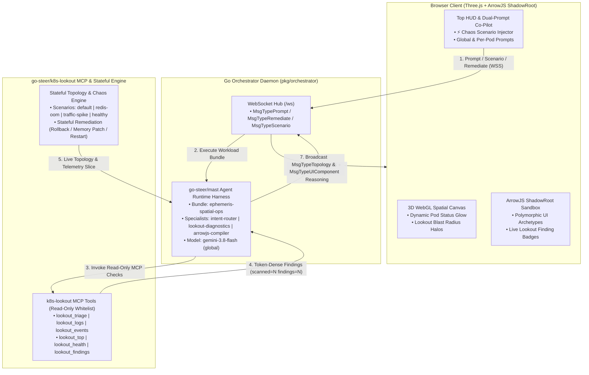

# Architectural Specification: `go-steer` Ecosystem Integration (`mast` + `k8s-lookout`) & Stateful Chaos Platform

## 1. Executive Summary

This document specifies the Phase 7 architecture for `ephemeris`, fulfilling the `go-steer` ecosystem integration envisioned in `tech-design.md`:
1. **`go-steer/mast` Agent Runtime Harness (`pkg/orchestrator/mast_harness.go`):**
   - Models `mast`'s workload bundle and multi-specialist execution pipeline (`WorkloadBundle`, `SpecialistSpec`, session transcripts, and budget ceilings) on top of Vertex AI (`gemini-3.8-flash` in `global` location via ADC).
   - Splits spatial incident triage into three explicit specialists:
     - `intent-router` (`ModeSingleTurn`): Translates natural-language SRE prompts into polymorphic UI archetypes (`issues_matrix`, `logs_console`, `namespace_inventory`, `resource_leaderboard`, `deep_triage`, `chaos_scenario`).
     - `lookout-diagnostics` (`ModeTask`): Invokes `k8s-lookout` MCP read-only diagnostic tools to gather token-dense, secret-sanitized findings (`scanned=N findings=N elapsed=D`).
     - `arrowjs-compiler` (`ModeSingleTurn`): Synthesizes reactive `@arrow-js/core` UI components bound to live telemetry and `k8s-lookout` findings.
2. **`go-steer/k8s-lookout` MCP Tools & Frozen Finding Envelope (`pkg/mcp/lookout.go`):**
   - Registers `k8s-lookout`'s read-path MCP tools (`lookout_triage`, `lookout_logs`, `lookout_events`, `lookout_top`, `lookout_health`, `lookout_findings`, `lookout_delta`, `lookout_state`) in `AllowedReadTools`.
   - Emits structured `LookoutFinding` records (`kind`, `severity`, `fingerprint`, `resource`, `namespace`, `summary`, `check_source`) and envelope summaries (`scanned=N findings=N elapsed=D`) directly into the ArrowJS UI panels and 3D spatial blast radius.
3. **Dynamic Telemetry Binding & Stateful Backend Remediation (`MsgTypeRemediate`):**
   - Replaces static mock arrays in polymorphic UI templates with live JSON-serialized slices derived from the active backend `*api.TopologyData`, `*api.TelemetryData`, and `[]api.LookoutFinding`.
   - Persists remediation actions (`1-Click Rollback`, `Memory Hot-Patch`, `Pod Restart`) in the backend topology state and broadcasts `MsgTypeTopology` updates to all connected WebSocket clients.
4. **Interactive Chaos & Incident Scenario Injector (`MsgTypeScenario`):**
   - Provides a top HUD **⚡ Chaos Injector** selector and natural-language prompt support for 4 multi-pod cloud incident scenarios:
     - `default`: Payment Crash (`CrashLoopBackOff`) & Batch Quota Exhaustion (`Pending`).
     - `redis-oom`: Redis OOM Cascade (`redis-cart` OOMKilled $\rightarrow$ `cart-service` 503s $\rightarrow$ `checkout-service` retry backlog).
     - `traffic-spike`: Black Friday Checkout Saturation (`frontend` & `checkout-service` CPU saturation + `Pending` autoscaling replica).
     - `healthy`: Zero-Incident Nominal State (`0` active issues across all clusters).

---

## 2. Architecture & Data Flow

