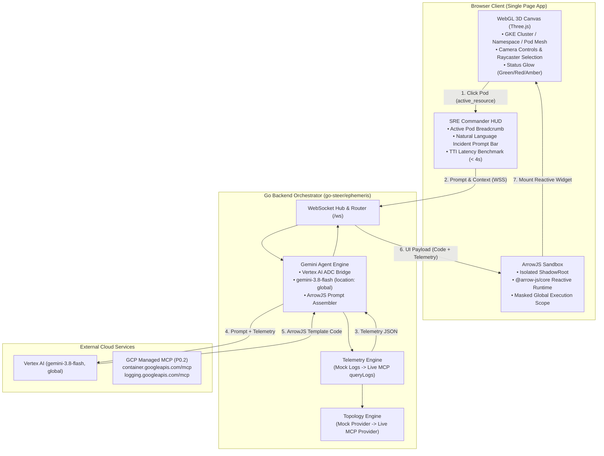

# Implementation Plan: Ephemeral Cloud Ops (MVP)

## 1. Overview & Objectives

Ephemeral Cloud Ops replaces static SRE dashboards with an interactive 3D WebGL topology mesh of Google Kubernetes Engine (GKE) clusters and uses LLM agents to compile ephemeral, reactive ArrowJS control interfaces on the fly during an incident.

This plan details the rapid end-to-end execution of the Read-Only MVP (P0) according to `docs/design/requirements.md` and `docs/design/tech-design.md`, adopting a **mock-first strategy** to validate the spatial UX, visual look and feel, and reactive sandboxing before wiring live GCP MCP endpoints.



---

## 2. Key Architecture & Design Decisions

### 2.1 Phased Delivery: Mock-First Validation
To rapidly test and iterate on the 3D visual experience, camera navigation, and reactive ArrowJS interface without dependency on a running GKE cluster or network latency:
- **Phase 1 (Mock Implementation First):** Implement a high-fidelity mock topology and telemetry engine representing a multi-namespace e-commerce microservices cluster (`online-boutique`) with an actively failing `payment-service` pod in `CrashLoopBackOff` (emitting real container crash logs, OOM events, and database timeout stack traces).
- **Phase 2 (Live GCP MCP Integration):** Wire the remote MCP client using Application Default Credentials (ADC) to query `container.googleapis.com/mcp` and `logging.googleapis.com/mcp`.

### 2.2 Serving & Deployment Options
The system supports three flexible runtime modes:
1. **Single Binary (Embedded):** The Go binary embeds compiled frontend assets via `embed.FS`. Running `ephemeris` serves both the WebGL SPA and WebSocket hub on a single port (e.g. `:8080`).
2. **Split Deployment:** The Go daemon serves only the API and WebSocket hub, with static assets served via an external web server, CDN, or configurable directory (`-static-dir`).
3. **Developer Hot-Reloading:** The Vite development server runs on `localhost:5173` and proxies WebSocket connections (`/ws`) to `localhost:8080`, providing instant hot module reloading (HMR) for UI development.

### 2.3 LLM & Vertex AI Configuration
- **Model:** `gemini-3.8-flash`
- **Provider & Auth:** Vertex AI using Application Default Credentials (ADC) via `google.golang.org/genai`.
- **Location:** `global` (with configurable override via `VERTEX_LOCATION` or `-vertex-location`).
- **Offline / Credential-free Fallback:** Deterministic ArrowJS template generator when ADC/credentials are absent so automated tests and UI demos remain functional.

### 2.4 ArrowJS Sandbox Security Boundary
- **ShadowRoot DOM Encapsulation:** LLM-generated UI mounts inside a `ShadowRoot` attached to a `<ephemeris-panel>` custom element. Styles and DOM manipulation are strictly prevented from leaking out to the Three.js canvas or parent document.
- **Restricted Execution Scope:** The code evaluator masks global objects (`window`, `document`, `localStorage`, `sessionStorage`, `fetch`, `XMLHttpRequest`, `WebSocket`) as `undefined`, exposing only `{ html, reactive, mount, data }`.

---

## 3. Component Breakdown & Directory Layout

```
ephemeris/
├── cmd/
│   └── ephemeris/
│       └── main.go                 # Server CLI entrypoint
├── pkg/
│   ├── api/
│   │   └── types.go                # WebSocket message protocol & domain models
│   ├── gke/
│   │   ├── provider.go             # GKE topology provider interface
│   │   ├── mock.go                 # High-fidelity mock topology (Phase 1)
│   │   └── mcp.go                  # GCP Managed MCP topology provider (Phase 2)
│   ├── telemetry/
│   │   ├── provider.go             # Telemetry provider interface
│   │   ├── mock.go                 # Mock log/metric generator with crash traces
│   │   └── mcp.go                  # MCP queryLogs provider (Phase 2)
│   ├── orchestrator/
│   │   ├── server.go               # HTTP & WebSocket hub, static file server
│   │   ├── agent.go                # Vertex AI gemini-3.8-flash agent client
│   │   └── prompt.go               # ArrowJS system prompt & code sanitizer
│   └── mcp/
│       └── client.go               # Read-only GCP MCP client with ADC token source
├── web/                            # Frontend SPA (TypeScript + Three.js + ArrowJS)
│   ├── package.json
│   ├── tsconfig.json
│   ├── vite.config.ts
│   ├── index.html
│   └── src/
│       ├── main.ts                 # Bootstrap & state orchestration
│       ├── canvas/
│       │   ├── scene.ts            # Three.js renderer, lighting, camera
│       │   ├── topology.ts         # 3D Node-graph mesh (Cluster/Namespace/Pod)
│       │   └── controls.ts         # Orbit controls & Raycaster selection
│       ├── sandbox/
│       │   ├── runtime.ts          # ArrowJS evaluator + ShadowRoot isolation
│       │   └── panel.ts            # Floating HUD panel widget
│       ├── ws/
│       │   └── client.ts           # WebSocket client with auto-reconnect
│       └── ui/
│           ├── hud.ts              # SRE Incident Commander HUD & prompt bar
│           └── styles.css          # Dark-theme SRE styling
└── Makefile                        # Build, test, and run automation
```

---

## 4. WebSocket Protocol Specification

All communication between browser and orchestrator occurs over `/ws`.

### 4.1 Client -> Server Messages
- `init`: Requests initial cluster topology.
  ```json
  { "type": "init" }
  ```
- `select_node`: Sets active contextual target in 3D scene.
  ```json
  {
    "type": "select_node",
    "selected_node_id": "pod-payment-service-84f7b6",
    "resource_uri": "gke://production/payment-service-84f7b6"
  }
  ```
- `prompt`: Submits natural language investigation query.
  ```json
  {
    "type": "prompt",
    "selected_node_id": "pod-payment-service-84f7b6",
    "resource_uri": "gke://production/payment-service-84f7b6",
    "prompt": "Why is this crashing? Highlight the fatal errors."
  }
  ```

### 4.2 Server -> Client Messages
- `topology`: Full cluster hierarchy.
  ```json
  {
    "type": "topology",
    "topology": {
      "clusters": [{
        "name": "production-cluster",
        "project_id": "ephemeris-prod",
        "location": "us-central1",
        "namespaces": [...]
      }]
    }
  }
  ```
- `status`: Step progress ("Fetching telemetry...", "Compiling ArrowJS UI...").
- `telemetry`: Cached/queried telemetry payload for the selected resource.
- `ui_component`: Executable ArrowJS template code and bound telemetry data.
  ```json
  {
    "type": "ui_component",
    "resource_uri": "gke://production/payment-service-84f7b6",
    "prompt": "Why is this crashing? Highlight the fatal errors.",
    "code": "/* ArrowJS component */\nconst state = reactive({ filter: 'FATAL' });\n...",
    "telemetry": { ... }
  }
  ```
- `error`: Error notification with human-readable description.

---

## 5. Phased Execution Roadmap

### Phase 1: Mock-First Look & Feel + Core Engine (P0.1)
1. **Protocol & Models (`pkg/api`):** Implement WebSocket payload structures and domain types.
2. **Mock Topology & Telemetry (`pkg/gke`, `pkg/telemetry`):**
   - Cluster with namespaces (`production`, `default`, `kube-system`).
   - Pods: `frontend`, `cart-service`, `catalog-service`, and failing `payment-service` (`CrashLoopBackOff`).
   - Realistic logs containing timestamps, severities (`INFO`, `WARNING`, `ERROR`, `FATAL`), and stack traces.
3. **Vertex AI Agent (`pkg/orchestrator`):**
   - Initialize `google.golang.org/genai` targeting `gemini-3.8-flash` in `global` location with ADC.
   - Assemble system prompt enforcing ArrowJS reactive output (`html`, `reactive`).
   - Deterministic fallback generator for credential-free testing.
4. **WebSocket Server & Multi-Mode Serving (`pkg/orchestrator/server.go`):**
   - WebSocket connection lifecycle and routing.
   - Dual serving: embedded `embed.FS` with fallback to directory (`-static-dir`).
5. **Frontend WebGL 3D Canvas (`web/src/canvas`):**
   - Three.js 3D force/orbital mesh representing clusters, namespaces, and pods.
   - Status shaders/colors: Green (`Running`), Amber (`Pending`), Pulsing Red (`CrashLoopBackOff`).
   - Orbit controls, Raycaster click targeting, camera focus tweening.
6. **ArrowJS Sandboxed UI Runtime (`web/src/sandbox`):**
   - ShadowRoot container overlaying canvas.
   - Safe code evaluator binding telemetry data to `@arrow-js/core`.
   - Floating reactive log viewer panel with severity filtering and auto-scroll.
7. **SRE Commander HUD (`web/src/ui`):**
   - Active pod context banner.
   - Natural language prompt bar with quick-triage chips.
   - Latency & TTI benchmark counter.

### Phase 2: Live GCP MCP Telemetry (P0.2)
1. **MCP Client (`pkg/mcp`):**
   - ADC authenticated HTTP transport querying `container.googleapis.com/mcp` and `logging.googleapis.com/mcp`.
   - Strict read-only whitelist gate (dropping mutating requests).
2. **Live Providers:**
   - `MCPTopologyProvider` querying GKE resources.
   - `MCPTelemetryProvider` invoking `queryLogs`.
3. **Mode Switch:** CLI flag `--mode=live` / `--mode=mock`.

---

## 6. Verification & Quality Gates

### Automated Verification
- `go test -v -race ./pkg/...`: Covers message serialization, topology generation, log parsing, prompt assembly, and sandbox code sanitization.
- `cd web && npm run build`: Validates TypeScript typing and bundle compilation.

### Manual UX Verification
1. Run `make run` and navigate to `http://localhost:8080`.
2. Inspect the 3D topology: verify cluster hierarchy, node colors, orbit controls, and mesh connections.
3. Click the red `payment-service` pod: verify smooth camera zoom, targeting ring, and HUD context update.
4. Submit the prompt `"Why is this crashing?"`:
   - Verify server log logs telemetry fetch and agent compilation.
   - Verify floating ArrowJS widget mounts in < 4 seconds.
   - Verify reactive filters and log tailing operate inside the widget.
   - Verify sandbox isolation: verify widget cannot read `localStorage` or touch the WebGL canvas.
