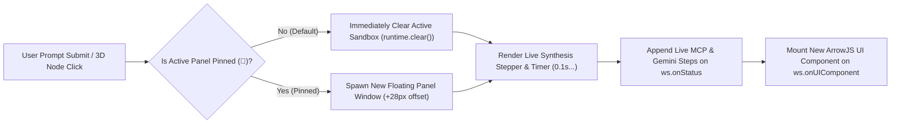

# Sandbox Lifecycle (Instant Clear & Live Stepper) & Multi-Panel Window Manager

## 1. Problem Diagnosis: Why the "Slow Replace" Happens

Currently, when a user submits a natural-language prompt in the HUD:
1. **Missing Immediate Sandbox Reset:** In `web/src/main.js` (`hud.onPromptSubmit`), if a prompt is not matched by client-side regexes (e.g. `"show me the services"`, or single-pod queries in section `5d`), `panel.showStreamingProgress()` is never called before `ws.sendPrompt()`. The previous ArrowJS component remains mounted in the `ShadowRoot` while the Go backend calls Vertex AI `gemini-3.8-flash` (`ResolveIntent`) and executes MCP tools (`lookout_resources`). Only when `ws.onUIComponent` finally arrives (~1–2 seconds later) does `panel.mount()` overwrite the container, causing a jarring "slow replace" where stale UI remains visible during generation.
2. **Inefficient Status Re-Compilation:** When `showStreamingProgress()` *is* called on `ws.onStatus`, it invokes `this.runtime.execute(streamingCode)` on every status tick—re-compiling an entire ArrowJS template via `new Function(...)` for every single status string rather than appending to an instant progressive step log.
3. **Single Panel Limitation ("Do we only have one spot for panel?"):** `IncidentPanel` is currently a singleton DOM element inside `#panel-container`. Every new query overwrites the single panel, making it impossible to keep an existing view (e.g. **Gateways & Routes** or **Incident Matrix**) open while inspecting another resource or running a follow-up query.

---

## 2. Proposed Architecture

### A. Instant Sandbox Clear & Live Progressive Stepper (`panel.startGeneration`)
Whenever any prompt is submitted (`hud.onPromptSubmit`, `panel.onObjectPromptSubmit`, or `hud.onScenarioSelect`):
- Immediately invoke `panel.startGeneration(title, initialStep)` **synchronously before `ws.sendPrompt()`**.
- `startGeneration()` immediately clears the previous ArrowJS `ShadowRoot` (`this.runtime.clear()`), starts a live `100ms` elapsed timer badge (`TTI: 0.1s...`), and renders a native, zero-latency **Agentic Synthesis Stepper** inside the panel body.
- As WebSocket `status` messages arrive (`🤖 [mast:intent-router]...`, `🔍 [k8s-lookout] Executing MCP tool...`, `🧠 [mast:arrowjs-compiler]...`), `panel.appendGenerationStep(statusMsg)` appends each step with checkmarks for completed stages and an active spinner on the current stage.
- When `ws.onUIComponent` arrives, the stepper is cleanly replaced by the newly compiled ArrowJS component.

### B. Multi-Panel Spatial Window Manager with Pinning (`📌 Pin Panel`)
To answer *"Do we only have one spot for panel?"*, we upgrade `#panel-container` from a single hardcoded panel to a **Multi-Panel Spatial Window Manager (`PanelManager`)**:
- **Default Behavior (Unpinned Active Panel):** By default, there is one primary active floating panel. Submitting a new prompt immediately clears and reuses this active panel.
- **Pinning (`📌 Pin` button in Panel Header):** Every floating panel header includes a **📌 Pin** toggle button (alongside Minimize `−` and Close `×`).
  - When a user clicks **📌 Pin** on a panel (e.g., pinning **K8s & CRD Objects: Deployments** or **Cluster Incident Matrix**), that panel is locked to the 3D workspace.
  - When the user submits a new prompt or clicks another 3D node while the current panel is pinned, `PanelManager` **automatically spawns a new floating panel window** offset by `(+28px, +28px)` with independent z-index focus, drag handle, minimize/close controls, and its own isolated ArrowJS `ShadowRoot` sandbox!
  - Users can have multiple live ArrowJS panels open simultaneously (up to 4 pinned panels) to compare Deployments, StatefulSets, Logs, and Triage side-by-side over the 3D topology.

---

## 3. Proposed File Changes

### Frontend (`web/src/`)

#### [MODIFY] [panel.js](file:///usr/local/google/home/garisingh/projects/ephemeris-mast-lookout-chaos/web/src/sandbox/panel.js)
- Add `isPinned` state and a **📌 Pin/Unpin** button (`this.pinBtn`) in `.panel-controls` header.
- Add `startGeneration(title, initialMessage)` and `appendGenerationStep(message)` methods:
  - Immediately calls `this.runtime.clear()` so stale ArrowJS DOM is wiped at `t = 0ms`.
  - Renders a live multi-step progress log with a `requestAnimationFrame` / `setInterval` live elapsed counter (`0.1s`, `0.2s`...) in `this.ttiBadge`.
- Export `PanelManager` class (wrapping `IncidentPanel` instances) that routes `startGeneration`, `mount`, `openObjectInspector`, and `showStreamingProgress` to the current unpinned panel—or spawns a new staggered `IncidentPanel` instance if the active panel is pinned (`isPinned === true`).
- Bring clicked/dragged panels to the front (`zIndex` management).

#### [MODIFY] [main.js](file:///usr/local/google/home/garisingh/projects/ephemeris-mast-lookout-chaos/web/src/main.js)
- Instantiate `PanelManager` (backward-compatible with `panel` API).
- At the very top of `hud.onPromptSubmit`, **unconditionally** call `panel.startGeneration(...)` before any branch (`5a`, `5b`, `5c`, `5d`), ensuring that **every** prompt (including single-pod queries and LLM-routed queries) immediately clears the unpinned sandbox and displays the live synthesis stepper.
- Update `ws.onStatus` to call `panel.appendGenerationStep(statusMsg)`.

#### [MODIFY] [styles.css](file:///usr/local/google/home/garisingh/projects/ephemeris-mast-lookout-chaos/web/src/styles.css)
- Add styling for `.panel-control-btn.pin` (active glowing cyan/purple pin state) and `.synthesis-stepper-log` for smooth step transitions.

#### [MODIFY] [main.test.js](file:///usr/local/google/home/garisingh/projects/ephemeris-mast-lookout-chaos/web/src/main.test.js)
- Add unit tests verifying:
  1. Submitting any prompt immediately clears previous ArrowJS sandbox DOM and shows the live synthesis stepper (`startGeneration`).
  2. Clicking the **📌 Pin** button pins the current panel, and submitting a subsequent prompt spawns a second independent floating panel without overwriting the pinned panel.
