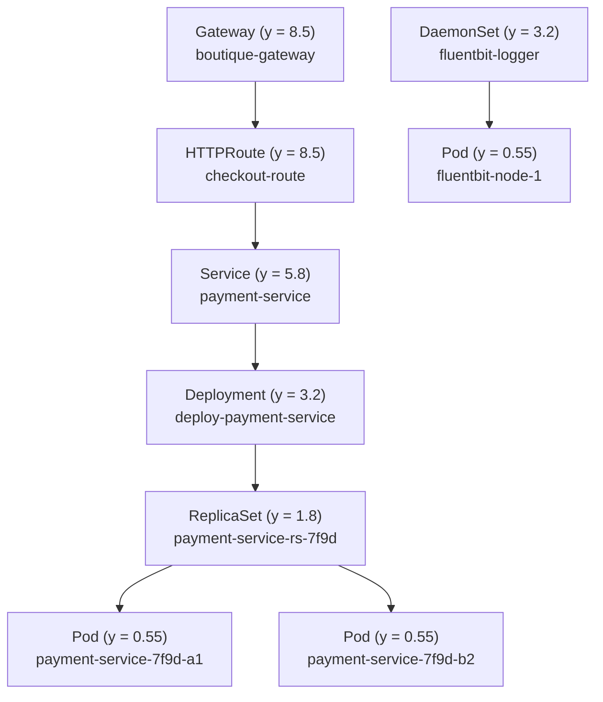

# 3D Spatial Ownership Hierarchy (Gateway -> Service -> Deployment -> ReplicaSet -> Pod) & Fleet Scale Stress-Test Engine

## 1. Overview & Motivation

To provide true Kubernetes spatial observability, Ephemeris must represent the full Kubernetes ownership and networking stack—not just flat rings of Pods—and prove that its 3D WebGL engine scales smoothly to hundreds of objects across large multi-cluster fleets.

This specification introduces two major capabilities:
1. **3D Hierarchical Ownership & Drill-Down Topology:**
   - Full support for `Gateway`, `HTTPRoute`, `Service`, `Deployment`, `ReplicaSet`, `DaemonSet`, `StatefulSet`, CRDs (`SparkApplication`, `RayCluster`), and `Pod` replicas.
   - **3D Stratified Elevation Layout & Drill-Down:**
     - **Layer 3 (Top Elevation, `y = +8.5`):** `Gateway` & `HTTPRoute` ingress nodes at the cluster edge.
     - **Layer 2 (Upper-Mid Elevation, `y = +5.8`):** `Service` load-balancer rings.
     - **Layer 1 (Lower-Mid Elevation, `y = +3.2`):** Workload Controllers (`Deployment`, `DaemonSet`, `StatefulSet`, CRDs).
     - **Layer 0.5 (Sub-Controller Elevation, `y = +1.8`):** `ReplicaSet` nodes directly beneath their parent `Deployment`.
     - **Layer 0 (Base Elevation, `y = +0.55`):** `Pod` replicas grouped beneath their owning `ReplicaSet` / `DaemonSet` / `StatefulSet`.
   - **Interactive Drill-Down & HUD Layer Filter:**
     - Clicking any `Deployment` or `ReplicaSet` in 3D highlights its entire ownership subtree (`Deployment -> ReplicaSet -> Pods`) and upstream `Service -> HTTPRoute -> Gateway` path, and opens a dedicated **Controller Ownership & Drill-Down Inspector** in ArrowJS.
     - A **3D Layer Toggle** in the HUD (`All Layers`, `Hierarchy (Deploy -> RS -> Pod)`, `Networking (GW -> Route -> Svc)`, `Pods Only`) lets SREs toggle or drill down into specific strata.

2. **Interactive Scale Stress-Test Engine (`⚡ Scale Stress Test`):**
   - A configurable backend & frontend **Scale Stress-Test Generator** capable of synthesizing massive multi-cluster topologies on demand:
     - **Presets & Custom Sliders:**
       - `Standard (3 Clusters, ~45 Objects)`
       - `Medium Fleet (6 Clusters, ~180 Objects)`
       - `Large Fleet Stress Test (12 Clusters, 600+ Objects: Gateways, Routes, Services, Deployments, ReplicaSets, DaemonSets, Pods)`
       - Custom parameter support (`clusters`, `namespaces_per_cluster`, `deployments_per_ns`, `replicas_per_deployment`) via HUD modal or natural-language prompt (e.g., `"run scale test with 8 clusters and 400 objects"`).
   - **WebGL High-Scale Optimization & Real-Time Performance Telemetry:**
     - Live **FPS / Object / Draw-Call Telemetry Pill** in the HUD (`60 FPS | 620 Objects | 12 Clusters`).
     - Distance-based Level-of-Detail (LOD) label culling so text billboards only render for nearby or hovered/selected nodes at high object counts, maintaining 60 FPS even with 600+ 3D nodes.

---

## 2. Data Model & API Extensions (`pkg/api/types.go`)

Add `OwnerID` / `OwnerKind` and hierarchical links to `K8sResource` and `Pod`:
- `K8sResource`:
  - `OwnerID string` (`json:"owner_id,omitempty"`): ID of the parent controller (e.g., `ReplicaSet` points to `Deployment` ID `deploy-payment-service`).
  - `ChildrenIDs []string` (`json:"children_ids,omitempty"`): IDs of child resources or pods (e.g., `Deployment` -> `["rs-payment-7f9d"]`, `ReplicaSet` -> `["pod-payment-1", "pod-payment-2"]`).
- New WebSocket Event (`scale_test`):
  - `Type: "scale_test"` with payload `{ "clusters": 8, "namespaces": 3, "deployments": 4, "replicas": 3 }` (or preset name `"standard" | "medium" | "large"`).
  - Returns a newly generated `TopologyData` broadcast over `/ws` and synthesizes a **Fleet Scale Benchmark & Hierarchy Dashboard** in ArrowJS.

---

## 3. Proposed File Changes

### Backend (`pkg/`)
- **`pkg/api/types.go`**: Add `OwnerID`, `OwnerKind`, and `ChildrenIDs` fields to `K8sResource` and `Pod`. Add `ScaleTestConfig` struct.
- **`pkg/gke/mock.go`**:
  - Add `ReplicaSet` (`rs-frontend-6b8`, `rs-payment-7f9`, `rs-checkout-4c2`, `rs-cart-9a1`) and `DaemonSet` (`ds-node-exporter`, `ds-fluentbit-agent`) resources to the baseline clusters with explicit `OwnerID` / `ChildrenIDs` linking `Deployment -> ReplicaSet -> Pod` and `DaemonSet -> Pod`.
  - Implement `GenerateScaleTopology(cfg api.ScaleTestConfig) *api.TopologyData` to procedurally generate `N` clusters with realistic hierarchies (`Gateway -> HTTPRoute -> Service -> Deployment -> ReplicaSet -> Pods` + `DaemonSets`).
- **`pkg/mcp/lookout.go` & `pkg/orchestrator/polymorphic.go`**:
  - Add `"ReplicaSet"` and `"DaemonSet"` to `extractKindsFromPrompt`, `canonicalOrder`, and `lookout_resources` MCP tool filtering.
  - Add `ArchetypeScaleBenchmark` (`synthesizeScaleBenchmarkUI`) and `synthesizeHierarchyDrilldownUI` so clicking a `Deployment` or `ReplicaSet` renders an interactive ownership tree with drill-down from `Deployment -> ReplicaSet -> Pod` replicas.
- **`pkg/orchestrator/server.go`**:
  - Handle WebSocket message `type: "scale_test"` and natural-language prompts like `"run scale test with 10 clusters and 500 objects"`.

### Frontend (`web/src/`)
- **`web/src/canvas/topology.js`**:
  - Render 3D meshes for `Gateway` (octahedral portal), `HTTPRoute` (torus node), `Service` (cylindrical ring), `Deployment` / `DaemonSet` / `StatefulSet` (box/prism controller node), and `ReplicaSet` (hexagonal plate) at stratified `y` elevations above their owned `Pod` replicas.
  - Draw glowing vertical/angled ownership beams (`Deployment -> ReplicaSet -> Pod` and `DaemonSet -> Pod`).
  - Implement `setLayerFilter(layerMode)` (`all`, `hierarchy`, `networking`, `pods`) and `drillDownController(resourceId)` to expand/focus a controller's ReplicaSets and Pods.
  - Add distance-based LOD label culling (`updateLOD(camera)`) and real-time FPS/object counter tracking.
- **`web/src/ui/hud.js` & `web/src/styles.css`**:
  - Add **3D Layer Switcher** pills (`All Stack`, `Deploy -> RS -> Pod`, `GW -> Route -> Svc`, `Pods Only`).
  - Add **⚡ Scale Test** selector (`Standard (45 obj)`, `Medium (180 obj)`, `Large Stress Test (600+ obj)`) and live **FPS & Object Telemetry Badge** (`60 FPS | 624 Objects`).
