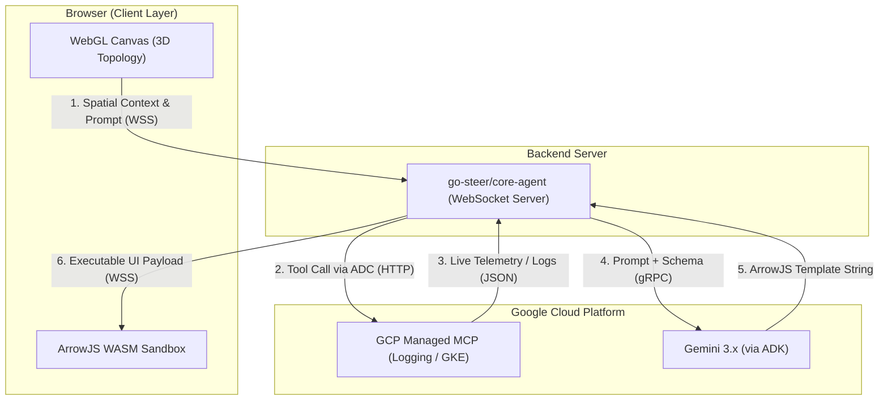

# Technical Design Document: Ephemeral Cloud Ops (MVP)

## 1. System Architecture Overview

The architecture is designed to completely decouple the data ingestion layer from the UI rendering layer. Instead of piping data into a pre-compiled React dashboard, telemetry is piped into a Gemini agent, which compiles a temporary UI sandbox in the browser on the fly.

## 2. Component Specifications

### 2.1 Client-Side: The Immersive Browser Environment

The frontend is a lightweight Single Page Application (SPA) serving two distinct visual layers:

* **The Spatial Canvas (Three.js):** Responsible for fetching the GKE node/pod topology from the backend on load and rendering it as an interactive 3D force-directed graph. It maintains a `selectedNodeId` state.
* **The UI Sandbox (ArrowJS):** A secure `QuickJS/WASM` sandbox that listens to the WebSocket. When the backend sends an ArrowJS component payload, this sandbox evaluates the JavaScript, binds it to the telemetry data stream, and mounts the resulting DOM nodes in an isolated `ShadowRoot` overlaying the canvas.

### 2.2 Server-Side: `go-steer/core-agent`

The orchestrator is a Go daemon utilizing the Google Agent Development Kit (ADK).

* **WebSocket Handler:** Maintains stateful connections with clients. When a user clicks a pod in 3D, the client sends a context update (e.g., `{"active_resource": "gke://cluster-1/default/pod-a"}`).
* **MCP Router:** Implements standard HTTP clients using Google Application Default Credentials (ADC). It maps standard Model Context Protocol tool requests to `[https://container.googleapis.com/mcp](https://container.googleapis.com/mcp)` and `[https://logging.googleapis.com/mcp](https://logging.googleapis.com/mcp)` [2].
* **Prompt Assembler:** Packages the system instructions, the spatial context, and the tool definitions into a single request to the Gemini model.

### 2.3 LLM Layer: Gemini 3.x

The model acts as the UI compiler. It is configured with a strict system prompt instructing it to *only* output ArrowJS template literals utilizing the `html` and `reactive` primitives, and to bind its data variables to the JSON payloads returned by the MCP tools.

## 3. Core Execution Flows

### 3.1 Initialization & Topology Discovery

When the engineer logs in, the platform maps the environment.

1. **Establish Connection:**
Client opens a WebSocket connection to `go-steer/core-agent`.

2. **Topology Query:**
Agent calls the GCP GKE MCP server using the `list_gke_resources` tool.

3. **3D Render:**
Agent passes the JSON hierarchy back to the client. The WebGL engine parses the JSON into 3D objects representing Clusters, Namespaces, and Pods.

### 3.2 The Generative UI Cycle (Incident Triage)

This is the core loop that replaces static dashboards.

1. **Context Trigger:** SRE selects a failing pod and types 'Why is this crashing?'.
The client sends the natural language prompt and the target Resource ID over the WebSocket.

2. **Telemetry Ingestion:** Backend limits latency by fetching data before UI generation.
The `core-agent` parses the intent, triggers the `queryLogs` MCP tool for that specific pod [2], and caches the resulting error logs in memory.

3. **Agentic Compilation:** Prompting Gemini 3.x.
The agent sends the prompt and a sample of the log data to Gemini with the instruction: *"Write an ArrowJS component that highlights the FATAL stack traces in this log stream."*

4. **Safe Rendering:** Browser WASM Execution.
Gemini returns the raw JavaScript code. `core-agent` pushes the code down the WebSocket. The client's ArrowJS sandbox safely executes it, rendering a bespoke log-viewer widget floating next to the pod in 3D.

## 4. Security & Guardrails (MVP Strict Limits)

Because the system allows an AI to generate and execute code in the browser based on production telemetry, security is the highest priority.

1. **Identity Propagation (No Service Accounts):** The `go-steer` backend will NOT use a global Service Account. It must rely on the individual SRE's `gcloud auth login` token passed via the browser session. If the SRE does not have IAM permission to view a specific GKE cluster's logs, the Google Cloud MCP server will reject the backend's query.
2. **WASM DOM Isolation:** LLM-generated code will never execute in the global `window` scope. ArrowJS runs inside a WebAssembly sandbox, meaning the generated UI cannot access `localStorage`, steal session tokens, or manipulate the parent WebGL canvas. It only has access to the exact telemetry payload provided by the backend.
3. **Read-Only MCP Whitelist:** For the MVP, `go-steer/core-agent` will physically drop any LLM tool call attempting to invoke a `POST`, `PUT`, or `DELETE` method. Only `GET` (list/query) tools will be registered with the agent harness.