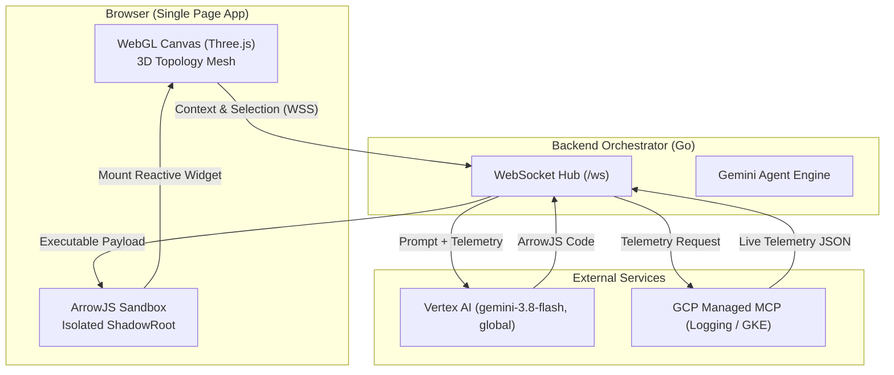

## System Overview

## Security & Sandboxing

1. **DOM Isolation:** ArrowJS components execute inside an isolated `ShadowRoot` overlaying the canvas.
2. **API Masking:** Global APIs (`window`, `localStorage`, `document`, `fetch`) are masked as `undefined` in the evaluator scope.
3. **Read-Only MCP Whitelist:** Outbound tool calls strictly enforce read-only semantics (`GET` only).
