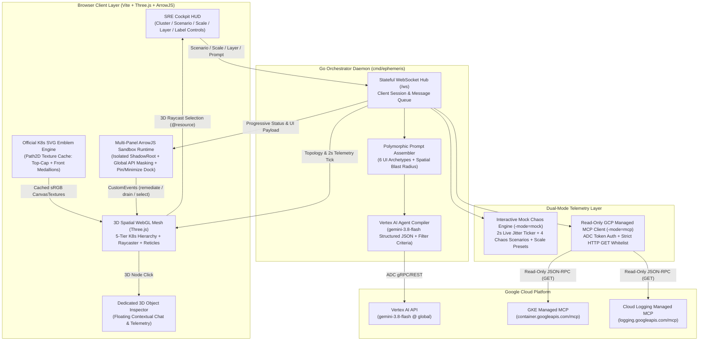

## 1. System Context & Component Architecture

`ephemeris` decouples cloud telemetry ingestion from UI presentation. Instead of piping logs and metrics into static 2D dashboards, spatial context and live telemetry are streamed to a Go WebSocket orchestrator (`cmd/ephemeris`) that compiles task-specific `@arrow-js/core` reactive control interfaces via Vertex AI (`gemini-3.8-flash`).

---

## 2. Stratified 3D Spatial Hierarchy & Official K8s SVG Medallions

`TopologyMesh` (`web/src/canvas/topology.js`) organizes Kubernetes resources into **5 vertical elevation tiers** above the cluster pedestal and mounts **Official Kubernetes Community SVG Medallions** (`web/src/canvas/k8s-icons.js`) onto both the **Top Cap (`+Y` aerial view)** and **Front Face (`+Z` zoom-in view)** of every 3D object:

| Elevation Tier | Y Elevation | Kubernetes Kinds | Official K8s SVG Medallion (`topMedallion` + `frontMedallion`) |
| :--- | :---: | :--- | :--- |
| **Tier 0: Control Plane** | `Y = 1.00` | `Cluster` | `control-plane.svg` (`#326ce5` Healthy / `#ea4335` Alert) |
| **Tier 1: Namespace Pad** | `Y = 0.45` | `Namespace` | Hexagonal territory platform + status border rim |
| **Tier 2: Compute Workloads** | `Y = 0.52` | `Pod` | `pod.svg` inside dashed 7-sided Kubernetes boundary |
| **Tier 3: Workload Controllers** | `Y = 1.35 – 2.15` | `ReplicaSet`, `Deployment`, `DaemonSet`, `StatefulSet`, `SparkApplication`, `RayCluster` | `rs.svg`, `deploy.svg`, `ds.svg`, `sts.svg` (with PV database cylinder), `job.svg` |
| **Tier 4: Service Mesh & Ingress** | `Y = 2.80 – 4.20` | `Service`, `HTTPRoute`, `Gateway` | `svc.svg`, `ing.svg` |

### 4 Semantic Zoom Bands
The top HUD performance pill (`#hud-perf-pill`) tracks camera distance across 4 semantic zoom bands:
- **`Macro` (`> 75`):** Multi-cluster satellite overview; shows cluster/namespace plaques and active incidents.
- **`Cluster` (`35 – 75`):** Default cluster cockpit; shows all K8s SVG medallions and incident badges, with pointer flyover reveal.
- **`Namespace` (`18 – 35`):** Shows full vertical ownership beams and service traffic conduits.
- **`Micro` (`<= 18`):** Automatically reveals nearby resource labels alongside front-facing K8s medallions.

---

## 3. Security & Multi-Panel Sandbox Isolation

1. **Shadow DOM Encapsulation:** Every generated widget mounts inside an isolated `ShadowRoot` overlaying the WebGL canvas.
2. **Global API Masking:** Browser globals (`window`, `document`, `localStorage`, `sessionStorage`, `fetch`, `XMLHttpRequest`) are masked as `undefined` inside the evaluator scope.
3. **Multi-Panel Windowing (`📌 Pin` & Minimize Dock):** Unpinned panels automatically clear at `t = 0ms` on new prompt submissions, while pinned panels (`📌`) persist across prompts for side-by-side comparison and can be minimized to `#hud-minimized-dock`.
4. **Read-Only MCP Whitelist:** Outbound GCP MCP calls strictly enforce `GET`-only semantics using Application Default Credentials (ADC).
