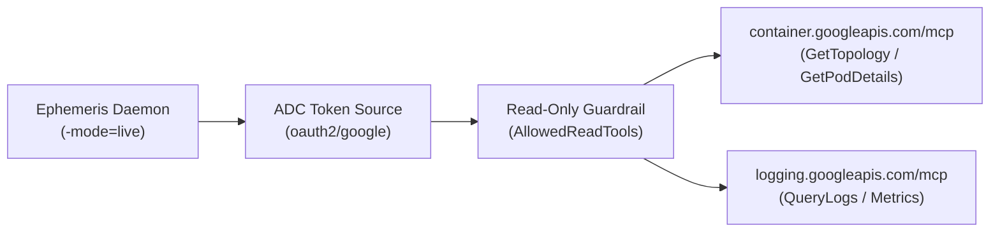

Ephemeris integrates with **Google Cloud Managed Model Context Protocol (MCP)** endpoints to discover live Google Kubernetes Engine (GKE) cluster topologies and stream container logs without requiring custom cluster sidecars or manual API keys.

## Dual-Mode Telemetry Architecture

Ephemeris operates in two seamless operational modes controlled via CLI flags:

| Mode          | CLI Flag     | Description                                                                                                                                                                                                                                      |
| :------------ | :----------- | :----------------------------------------------------------------------------------------------------------------------------------------------------------------------------------------------------------------------------------------------- |
| **Mock Mode** | `-mode=mock` | Zero-dependency high-fidelity simulation of a 3-cluster GKE production topology (`production-us-central1`, `staging-us-east1`, `batch-compute-eu-west1`) with realistic CrashLoopBackOff panics and scheduling bottlenecks.                      |
| **Live Mode** | `-mode=live` | Queries Google Cloud Managed MCP endpoints (`container.googleapis.com/mcp` and `logging.googleapis.com/mcp`) using Google Application Default Credentials (ADC). Automatically falls back to mock mode if credentials or project IDs are absent. |



## Security & Read-Only Guardrails

Because Ephemeris synthesizes AI-generated control interfaces during live incidents, strict security boundaries are enforced in `pkg/mcp/client.go`:

1. **Identity Propagation via ADC:**
   The MCP client acquires short-lived OAuth2 bearer tokens using `google.DefaultTokenSource` scoped to `https://www.googleapis.com/auth/cloud-platform`. Every MCP request inherits the exact IAM permissions of the authenticated SRE.
2. **Strict Read-Only Whitelist:**
   Outbound JSON-RPC `tools/call` requests are validated against an immutable read-only whitelist (`AllowedReadTools`) before any network transmission occurs:
   - `list_gke_clusters`
   - `list_gke_resources`
   - `list_namespaces`
   - `list_pods`
   - `get_cluster`
   - `get_pod`
   - `get_pod_details`
   - `query_logs`
   - `get_metrics`

Any tool invocation outside this whitelist (such as mutating or destructive operations) is immediately rejected by the client guardrail.

## Running in Live Mode

To launch Ephemeris against a live GCP project:

```bash
# Authenticate Application Default Credentials
gcloud auth application-default login

# Start the Ephemeris daemon in live mode
./bin/ephemeris \
  -mode=live \
  -gcp-project=your-gcp-project-id \
  -vertex-location=global \
  -model=gemini-3.8-flash \
  -port=8080
```
